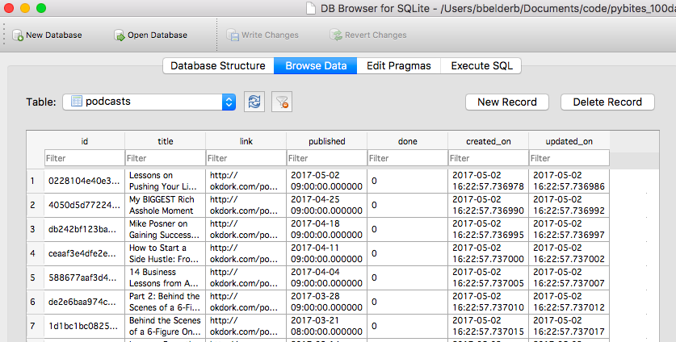
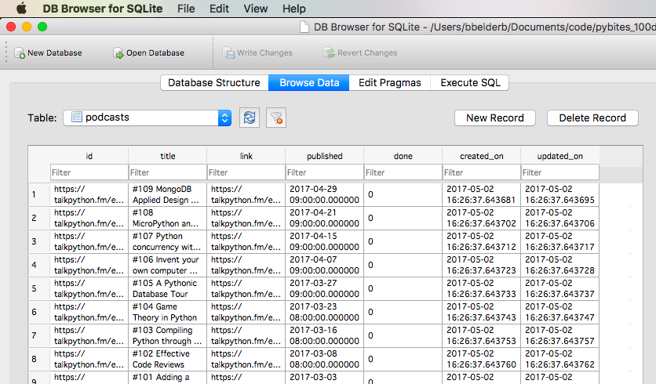

## 034

Prep work for [this week's code challenge](https://pybit.es/codechallenge17.html):

Dump feed in sqlite DB:

	$ python podcast.py  --feed http://noahkagan.libsyn.com/rss

	$ lt
	...
	-rw-r--r--  1 bbelderb  staff    72K May  2 16:22 podcast.db

Leave off feed and it takes default [Talk Python To Me](https://talkpython.fm/) feed:

	$ python podcast.py

