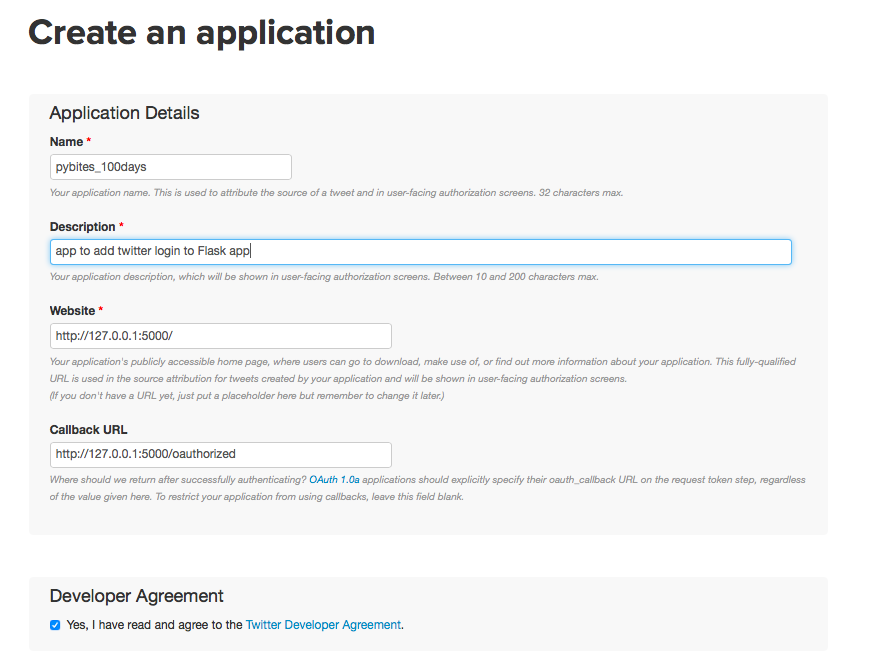
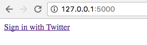
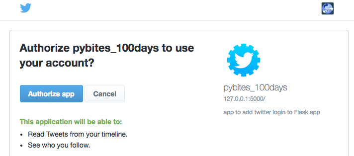
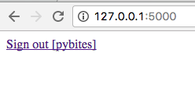

## 038

Snippet to add Twitter login to your Flask app. Basically I got [this](https://github.com/lepture/flask-oauthlib/blob/master/example/twitter.py) working ([myreadinglist app](https://pybit.es/codechallenge16_review.html)) and adapted it slightly when testing.

### Steps

* Create [Twitter app](https://apps.twitter.com/app/new), see printscreen below, note the Callback URL.

* Note down consumer_key and consumer_secret

* Set env vars (and/or persist them in your .bashrc):

        $ export PYB_100D_TW_KEY=abc
        $ export PYB_100D_TW_SECRET=def
        $ export PYB_100D_APP_SECRET=ghi

* Start app:
    
        $ python app.py

### Demo

Create app:

Login:

Twitter asks you to authorize the app:

Logout:

### TODO

Do actual stuff with Twitter API (load feed, post, etc)
