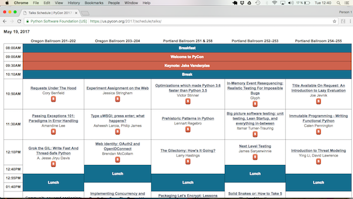
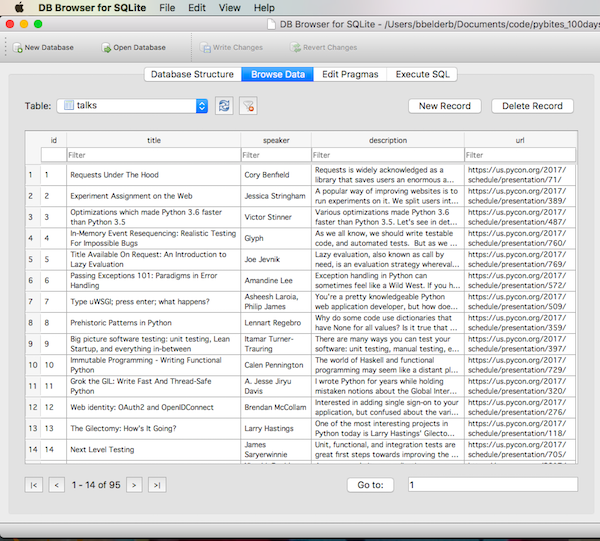
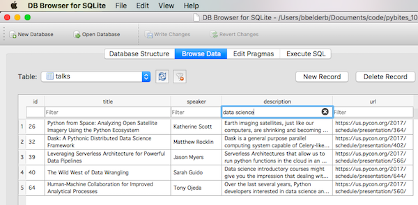

## 055

I thought it would be a fun little exercise to load all PyCon 2017 talks into an SQlite DB, maybe to keep track of what I watch (set a % goal maybe?)

I made [a script](talks.py) that uses BeautifulSoup to scrape the (downloaded) talks site. It puts the talks into namedtuples and imports them into the DB:

