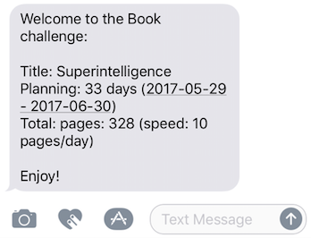
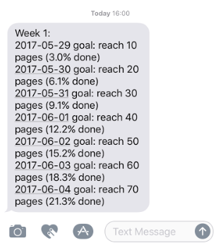

## 061

Solution for [Python Code Challenge 20 - OOP fun](https://pybit.es/codechallenge20_review.html): a book/video task planner that sends a weekly SMS (Twilio API) with material to consume.

## Install

Isolate env and install dependencies:

	$ python3 -m venv venv && source venv/bin/activate
	$ pip install -r requirements

Setup secret tokens and Twilio (from) phone (.bashrc)

	export TWILIO_SID='...'
	export TWILIO_TOK='...'
	export TWILIO_PHONE='+...'

## Usage

	$ python plan.py --help
	Usage: plan.py [OPTIONS]

	Options:
	--resource TEXT       resource type (book, video)
	--title TEXT          title of resource
	--total_units TEXT    total units resource (book = pages, video = min)
	--units_per_day TEXT  total units (book = pages, video = min) per day
	--start_in_days TEXT  number of days from now we kick this off (optional)
	--to_phones TEXT      list of phone numbers to notify
	--help                Show this message and exit.

## Tests

I used pytest:

	$ pytest
	===... test session starts ...===
	platform darwin -- Python 3.6.0, pytest-3.1.0, py-1.4.33, pluggy-0.4.0
	rootdir: /Users/bbelderb/Documents/code/pybites_100days/061, inifile:
	collected 2 items

	test_plan.py ..

	===...  2 passed in 0.38 seconds ...===

## Live example

	$ nohup $HOME/bin/python3/bin/python3.5 plan.py --resource Book --title superintelligence --total_units 328 --units_per_day 10 --to_phones "phone1 phone2 phone3 ..." &

First SMS:

First week's assignment exactly on Monday 8 am MT:

