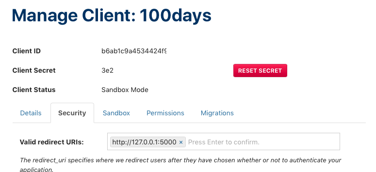

## 098

Experimenting with the IG API

> Script to use the #Instagram #API to authenticate and pull your media

1. Create an IG app:

	

		pip install [python-instagram](https://github.com/facebookarchive/python-instagram)

2. Note this library is not actively maintained. [get_access_token.py](https://github.com/facebookarchive/python-instagram/blob/master/get_access_token.py) has a bug: 

		$ python get_access_token.py
		...
		instagram.oauth2.OAuth2AuthExchangeError: You must provide a client_id

	Patch with [this fix](https://github.com/vgavro/python-instagram/commit/9dfc264571ad7c343af3899445d13afedf23e3aa) or make your own method, e.g. [`exchange_code_for_access_token`](https://stackoverflow.com/questions/38329960/instagram-api-keep-raise-you-must-provide-a-client-id-exception-when-i-use-pyt).

	Another required fix: when querying my media I got: 

		for comment in entry['comments']['data']:
		KeyError: 'data'

	Fix [here](https://github.com/facebookarchive/python-instagram/pull/235/files). 

_Conclusion_: probably need to fork this repo or make own wrapper using `requests` or something.
